# Module 3 Lesson 2 Lab 1: Organization Setup

## Overview

### Background

In this lab for Microsoft Cloud for Sustainability, you'll use demo data to set up the "Set up organization and reference data" scenario. Contoso Corp is a specialty coffee distribution business with operations in APAC, US, Africa, and Europe.

Contoso Corp is experiencing supply chain challenges when transporting its finished goods across the United States. Additionally, it wants to augment its transportation and logistics capacities. To overcome this challenge, Contoso Corp acquired a transportation business called Wide World Importers, which is based in Florida, US. Wide World Importers has two office facilities with 100 employees that coordinate a fleet of 40 electric trucks that will be used for transportation of finished goods across the US.

The newly created data in this exercise will form the foundation for the rest of the scenarios (data ingestion, calculations, and reporting) in the subsequent exercises.

### Learning Objectives

In this lab, you will perform the following:

- Review the company profile for Contoso Corp, add Wide World Importers to the organizational structure, and add the two Florida facilities

- Create reference data for contractual types

- Create units with conversion factor

- The newly created data during this lab exercise will form the foundation for the rest of the scenarios (data ingestion, calculations, and reporting) in the upcoming lab exercises.

### Prerequisites

- Microsoft Sustainability manager environment is set up with sample data

### Solution Focus Area

Organization setup focuses on the foundational steps required to configure the Microsoft Sustainability Manager application. These foundational steps will create the company profile, set up organizational structure and hierarchy, and corresponding facilities. After this, reference data will be set up that includes important information such as fuel types, vehicle types, contractual instrument types, and units. Some of this reference data is unique to an organization, and some will come from standard or industry sources.

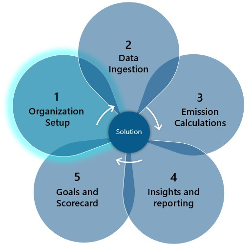

### Personas and Scenarios

This exercise features the following personas:

•	Jessie Irwin - Sustainability lead for Contoso Corp

•	Amber Rodriguez - Sustainability specialist for Contoso Corp

•	Alex Serra - Emissions analyst from Wide World Importers

•	Reed Flores – IT admin from Wide World Importers

These personas will participate in the following sequential scenarios:

1. Amber will educate Alex on the tools and processes that are used for Contoso's 
       sustainability reporting.
2. Jessie will guide Alex on building an inventory management plan by 
       listing the operating boundaries, facilities, and emission sources.

3. Jessie and Amber will demonstrate Microsoft Sustainability Manager 
       and will share the inventory plan template with Alex and Reed.

 4. After completing the inventory plan template, Alex and Reed will set up the company profile, 
       organization data, and reference data based on the data that Amber provided in the inventory plan.

In this lab exercise, we will focus on the scenarios illustrated below:

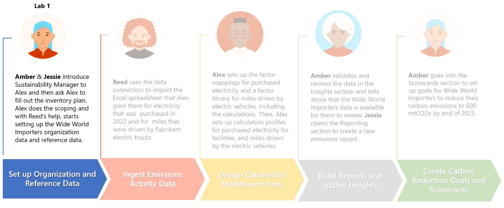

## Exercise 1: Set up company profile and reference data

In this exercise, you will learn about the steps that Alex and Reed take to set up Wide World Imports company profile, organizational data, reporting years and reference data. You can explore this functionality in deeper detail on Microsoft Docs. To do this visit **Set up a company profile** at https://docs.microsoft.com/en-us/industry/sustainability/setup-company-profile.

1. Log into the virtual machine using the virtual machine credentials located on the **Resources** tab above.

1. Open a new browser window and navigate to https://make.powerapps.com.

1. Log into your Microsoft 365 tenant using the credentials for the tenant located on the **Resources** tab above.

1. If needed, change the environment to **Microsoft Cloud for Sustainability Trial** on the top bar.

1. Open the **Sustainability Manager** Application under Apps from the left navigation pane.

    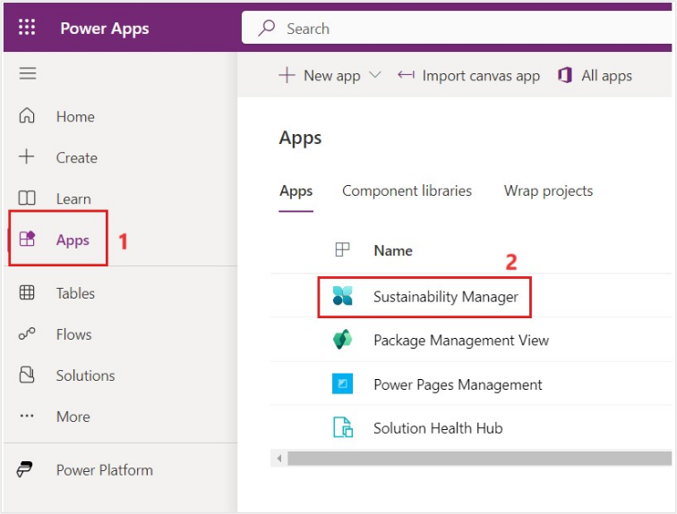

You will land on the **Home** page for Microsoft Sustainability Manager.

>[!NOTE] **Note**: You can dismiss the Product tour by scrolling down and selecting the **Dismiss tour** button.

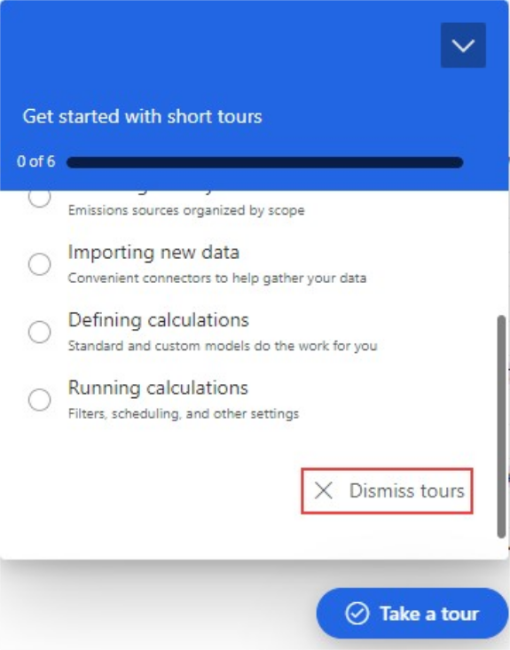

Area navigation is a common first step in each lab and exercise. You can find the area navigation menu in the bottom corner of your screen.

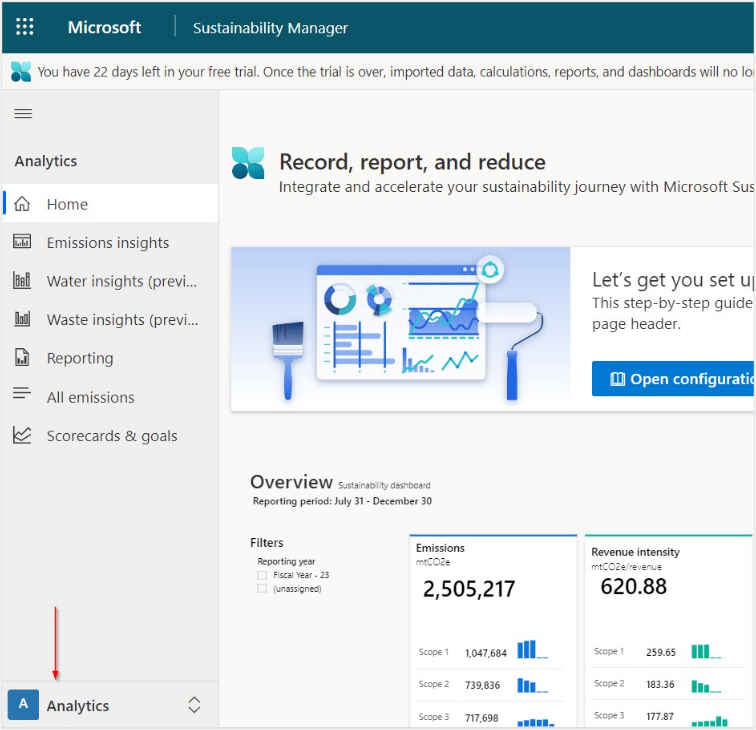

## Task 1: Setup the Company profile, hierarchy, and facilities

In this task, Alex sets up the Company profile, hierarchy, and facilities for the Wide World Importers organization in Microsoft Sustainability Manager.

1. In the bottom left corner, change your Area to **Settings**.

    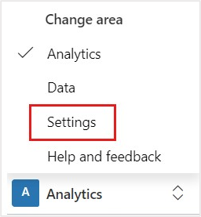

1. Navigate to **Company profile** on the left navigation pane of the home page.

    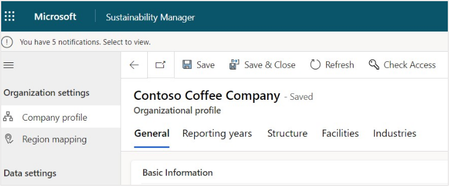

1. The Company profile page includes basic information about the organization, such as name, address, company logo, the annual reporting period, and relevant industries. Additionally, there are tabs at the top of the page for setting up organization structure and facilities, both will be covered in this exercise.

   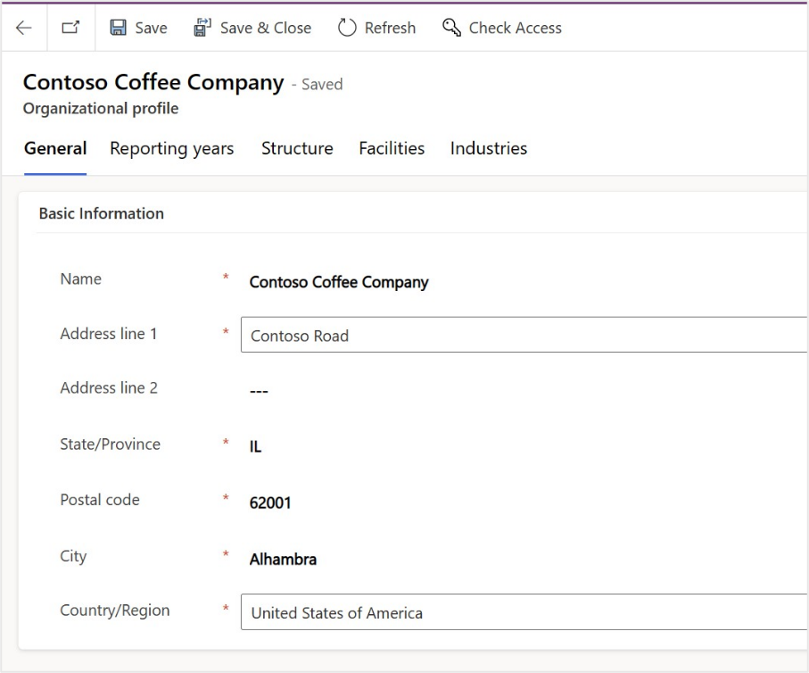

1. On the **Company profile** page, select the **Industries** tab. Microsoft Sustainability Manager includes a selection of pre-defined industries and sub-verticals based on NACE standards, see NACE Code at https://nacev2.com/en. Select **+Add**.

   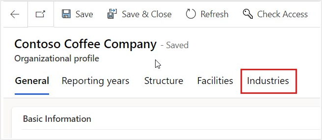

   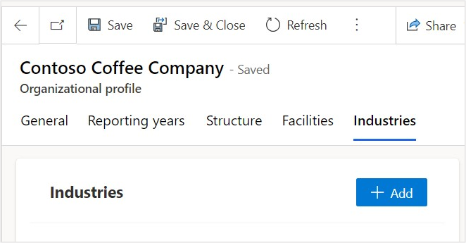

1. Select **Transportation and storage**.

    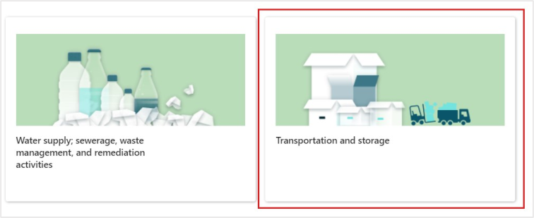

1. In the next screen, select **Land transport and transport via pipelines** and select **Add**.

    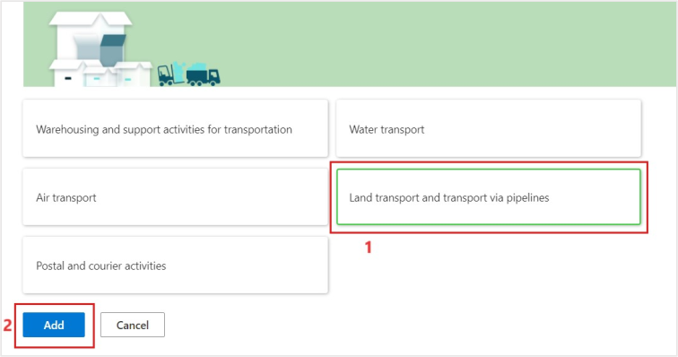

1. **Land transport and transport via pipelines** is now visible in the **Industries** section at the bottom of the **Company profile** page.

    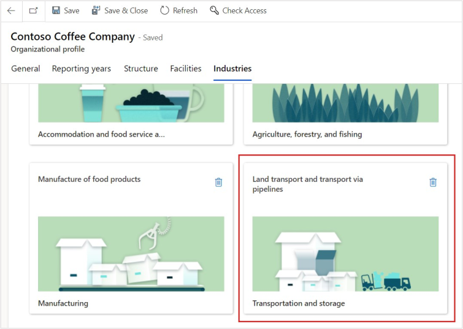

1. In the **Company profile** page, switch to the **Structure** tab.

  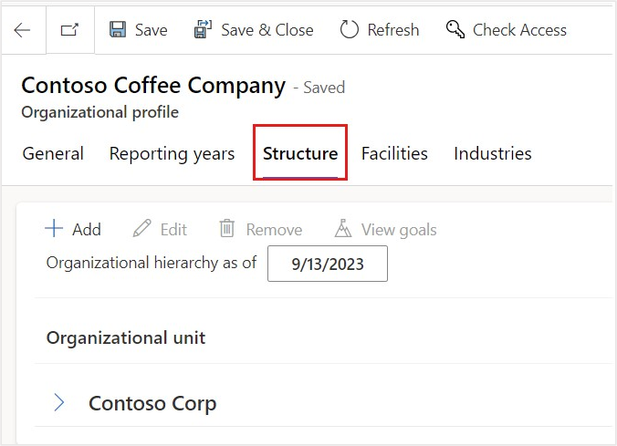

9. Select **Contoso USA** and select **Add** to add a new organizational unit under it.

    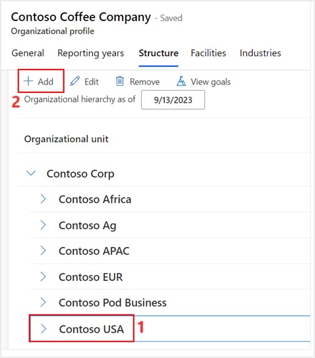

1. Enter the following data for organizational unit and select **Save** in the button pane:

    1. **Name**: Wide World Importers
    1. **Organizational unit type**: Department

   

1. In the **Organizational hierarchies** section, which appears after selecting **Save**, select **+ New Organizational hierarchy**.

    

1. Set the following values and select **Save & Close**:

    1. **Parent**: Contoso USA
    1. **Effective start date**: The first day of the current month (MM/DD/YYYY)

    

1. After being returned to the **Organizational Unit**, select **Save & Close** to return to the **Company profile**.

    

1. If necessary, navigate to **Company profile**, switch to the **Facilities** tab page and select **Add facility**.

  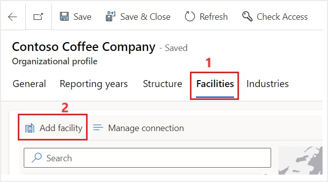

1. Create a new Facility with the following details. Once the values are entered, select **Save & Close**:

    >[!NOTE] **Note:** Pay close attention to the data used in this lab. The following labs will reference this data, and it will need to match exactly as seen in the lab.

    1. **Name**: Wide World Importers - Miami Office
    1. **Address line 1**: Brickell Avenue
    1. **City**: Miami
    1. **State**: Florida
    1. **Zip**: 33132
    1. **Country**: United states of America
    1. **Latitude**: 25.774320
    1. **Longitude**: -80.187720

    >[!NOTE] **Note:** Latitude and Longitude are not required but are used to display a pin on the Facilities map. They can be automatically added by selecting an address from the autocomplete options in Address line 1, or manually entered.

    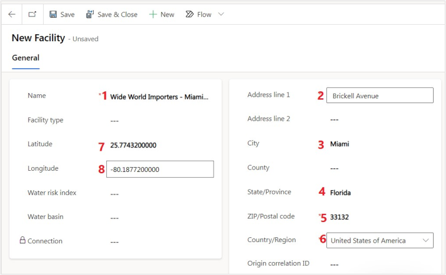

1. Using the same steps, add another new **Facility**. Once the values are entered, select **Save & Close**.

    >[!NOTE] **Note:** Pay close attention to the data used in this lab. The following labs will reference this data, and it will need to match exactly as seen in the lab.

    1. **Name**: Wide World Importers - Tampa Office
    1. **Address line 1**: Lois Avenue
    1. **City**: Tampa
    1. **State**: Florida
    1. **Zip**: 33609
    1. **Country**: United states of America
    1. **Latitude**: 27.944830
    1. **Longitude**: -82.514050

>[!NOTE] **Note:** Latitude and Longitude are not required but are used to display a pin on the Facilities map. They can be automatically added by selecting an address from the autocomplete options in Address line 1, or manually entered.

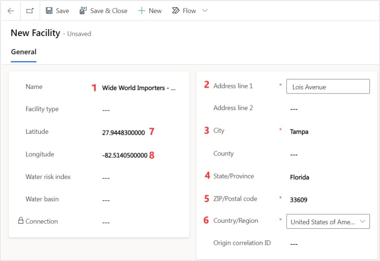

Great job, by completing these steps, you have assisted Alex with completing the organizational setup in Microsoft Sustainability Manager for Wide World of Importers. This included the Company profile, hierarchy, and facilities. Organizational structure and facility management will be linked to activity and emission data to group emissions by Organization, facility, and even regions. This is an important part of carbon emission reporting and organization disclosures. **Please continue to the next task.**

===

## Task 2: Setup reference data

In this task, Reed sets up the reference data for contractual instrument types in Microsoft Sustainability Manager. Contractual instrument types are the different types of contractual agreements that a firm has with their providers and suppliers.

1. In the bottom left corner, change the Area to **Settings**, if necessary.

  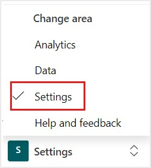

1. Navigate to **Reference data** on the left side of the page.

   

1. Select **Contractual instrument types** and select **View**.

    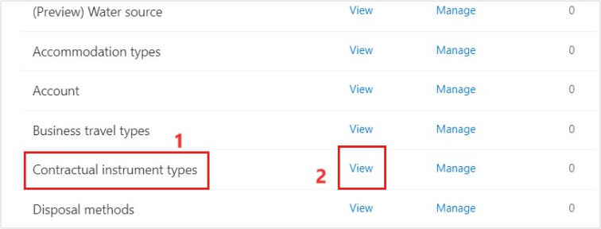

1. Under **Active contractual instrument types**, select **New** to create new contractual types.

    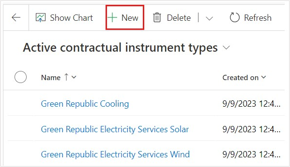

1. Create a new Contractual Instrument with the following details. Once entered, select **Save & Close** in the button pane.

    1. **Name**: VanArsdel Ltd
    1. **Energy source**: Nuclear

    >[!NOTE] **Note:** Pay close attention to the data used in this lab. The following labs will reference this data, and it will need to match exactly as seen in the lab.

   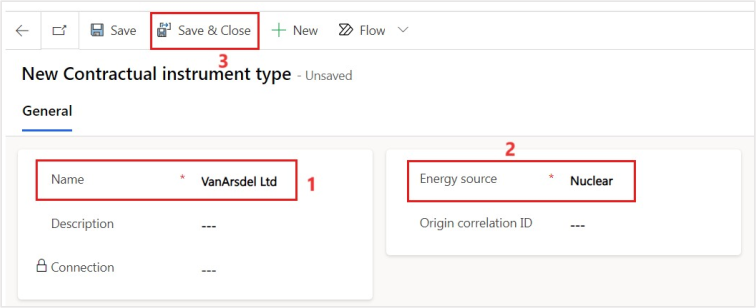

1. In the same way, again create a new Contractual Instrument with the following details. Once entered, select **Save & Close** in the button pane.

    1. **Name**: Adatum Corp
    1. **Energy source**: Other

   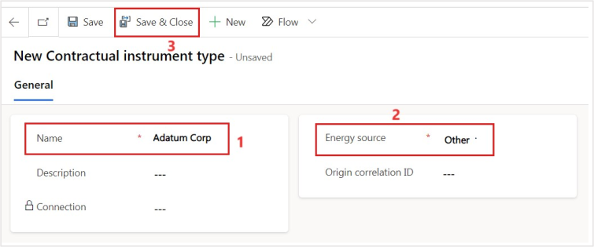

    >[!NOTE]**Note:** Pay close attention to the data used in this lab. The following labs will reference this data, and it will need to match exactly as seen in the lab.

Great job, by completing these steps, you have helped Reed add reference data for contractual instrument types. There are many types of reference data. Take some time after this lab to explore the other reference data types. They will be used throughout Microsoft Cloud for Sustainability, and Microsoft Sustainability Manager. **Please continue to the next task.**

===

## Task 3: Setup Unit conversion factor

In this task, Reed sets up a unit conversion factor in Microsoft Sustainability Manager. While reviewing the inventory management plan, Alex identifies a missing unit of distance needed to calculate emissions for the fleet of electric vehicles. They ask Reed to add a new unit to the Length/Distance unit group.

Unit Groups are used to group units together and define a base unit used to convert between unit types. For example, the Length/Distance unit group contains units of length and distance, with a base unit of meter (m). The units within the Length/Distance unit group have conversions between the unit type and meter, such as miles convert to 1,609.344 meters. You can explore this functionality in deeper detail on Microsoft Docs, please visit **Set up unit groups** at https://docs.microsoft.com/en-us/industry/sustainability/setup-unit-groups.

1. Navigate to **Unit groups** on the left side of the page.

    

1. Under **Active unit groups**, select **Length/distance** and open it.

   

1. Select **New unit** to create a new unit.

   

1. Enter the following details to create a new unit. Once entered, select **Save & Close** from the button pane.

    1. **Name**: 100 mile
    1. **Conversion factor**: 160934.40

>[!NOTE] **Note:** The EPA calculates electric vehicle efficiency by the number of kilowatt hours (kWh) used per 100 miles. For consistency, it is best practice to utilize the same

Great job, by completing these steps you have helped Reed add the missing unit for the fleet for elctric vehicles to the Length/Distance unit group to Microsoft Sustainability Manager.

## Task 4 : Create a reporting year 

Alex and Reed will set up the reporting years in Microsoft Sustainability Manager. Alex will name the reporting year, set up the start date and use a template to create more than one period. 

>[!NOTE] **Note:** The Reporting years you set up will override the configuration in General settings.

Alex proceeds to create a reporting year in Sustainability Manager. For detailed information, see Configure reporting years 

1.	In the left navigation pane, under **Organization settings**, select **Company** **profile**. Select the **Reporting years** tab.

   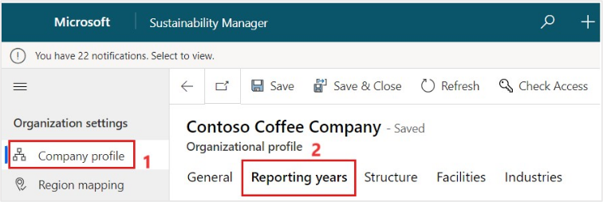
 
4.	Select **Create reporting year.**

  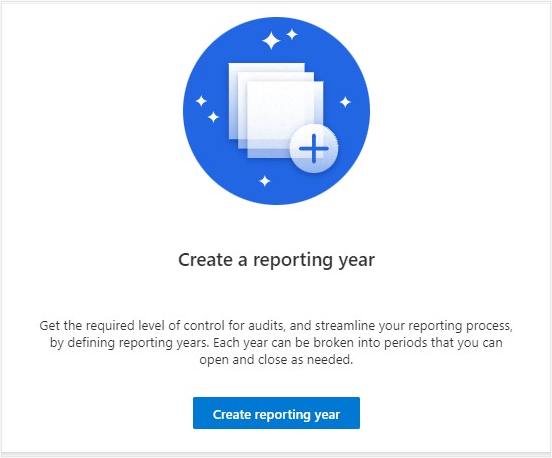

 
6.	Enter the following details. After you've entered the values, select **Save**. 

  	a.	**Name** - Enter Fiscal – 2022.  This name appears on the **Insights** page in Microsoft Sustainability Manager.

  	b.	**Start date**: 01/01/2022.  

  	c.	**Year template** - Annual.

       

 
8. Select **Close**. The reporting year will generate with the first period starting on the **Start date** and the last period ending one year from the **Start date**.

**Congratulations!** Alex and Reed of Wide World Importers now have their organizational structure set up along with the contractual instrument types, and a new unit in the Length/Distance unit group. This forms the foundation for the rest of the work they will do with the Microsoft Cloud for Sustainability and Microsoft Sustainability Manager. These data points are used throughout the tools, so it is important to spend the time to ensure that your organization and reference data is set up correctly.
