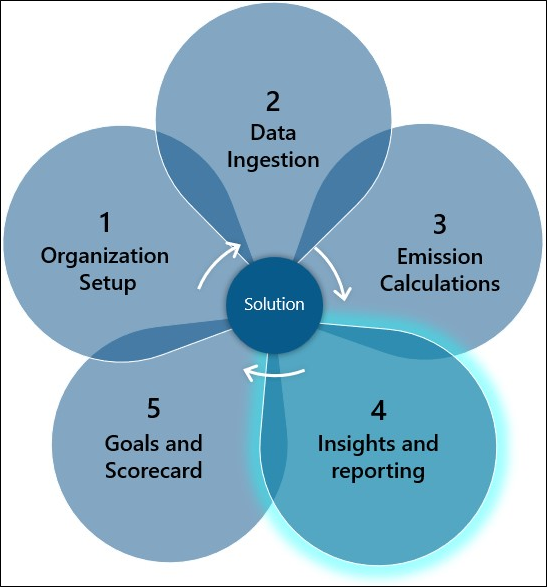
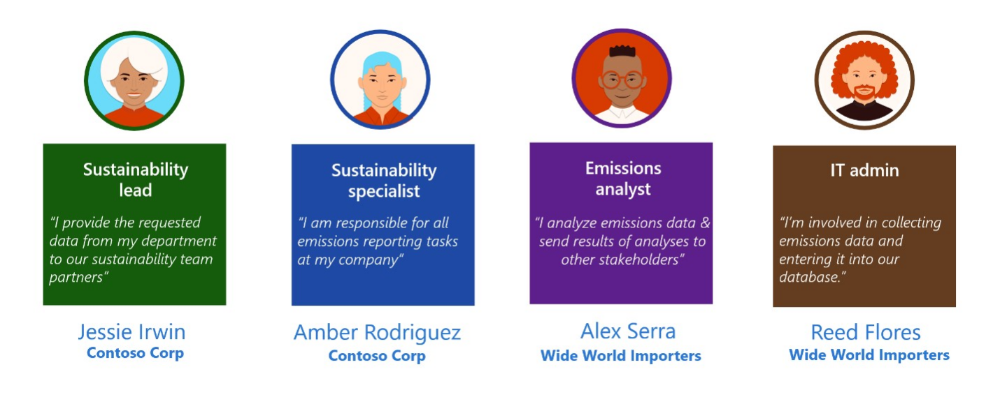
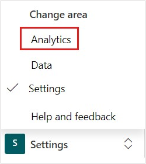
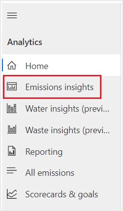
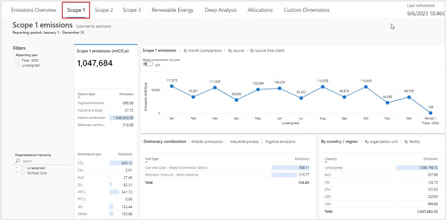
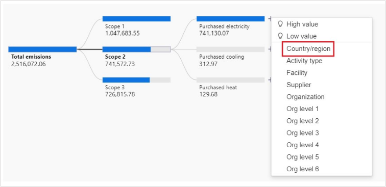
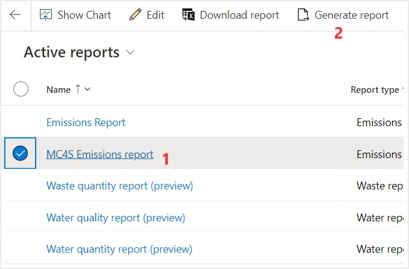
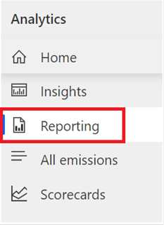
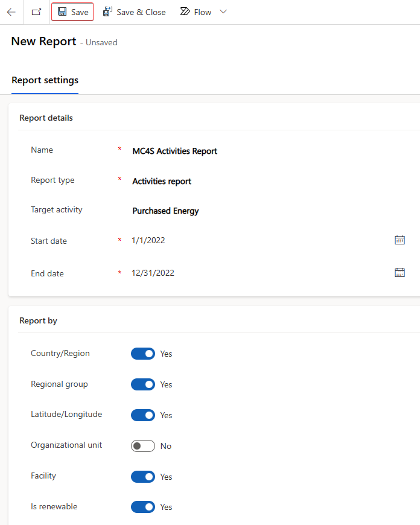
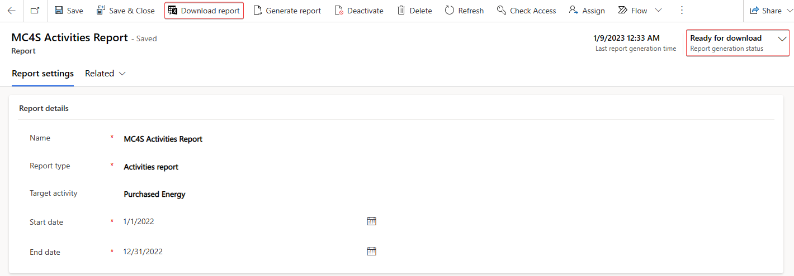

---
lab:
    title: 'Lab 4: Insights and reporting'
    module: 'Module 6: Configure insights and reporting'
---
# Module 6 Lesson 2 Lab 4: Insights and reporting

## Overview

### Background

In the previous lab, the ingested Activity data was taken through calculation designs using calculation models and the output was reviewed in terms of CO2E unit. In this lab, we will perform a set of activities to generate emissions reports, activity reports, and review Power BI dashboards.

Finally, this lab will help us gain insights into the emission activity trends and identify the opportunities to set scorecards and carbon reduction goals that are detailed in the next lab.

### Learning Objectives

In this lab, you will do the following:

-   Analyze various Sustainability Dashboards
-   Generate Emissions Report
-   Generate Activity Report
-   Review Power BI Insights

### Prerequisites

-   Microsoft Sustainability manager environment is set up with sample data
-   Lab 1 organization and reference data is entered
-   Lab 2 activity data is ingested
-   Lab 3 emissions are calculated

### Solution Focus Area

Analytics reports present calculated emissions in an organized way to detect trends and perform further exploration of data. These reports are updated soon (within approximately 30 minutes) after the calculations are run and allow the users to review the outcome of calculations in an aggregated format. Data can also be exported in predefined report formats that include groupings for emissions and activity, and other dimensions. These formats can be used to do deeper analysis and prepare many different types of reports.

### Personas and Scenarios

In this lab, Amber Rodriguez – Sustainability specialist for Contoso Corp reviews the data in the Insights section of Microsoft Sustainability Manager, noticing that Wide World Importers was a large contributor to Scope 2 emissions in 2022. Amber informs Jessie Irwin - Sustainability lead for Contoso Corp that the Activity and Emission Reports are available for review. Jessie opens the reporting section and creates a new Activity report and a new Emissions report. Jessie reviews the generated report and includes the report in the sustainability reporting procedures for Contoso Corp.

In this lab exercise, we will focus on the scenarios illustrated below:

## Exercise 1: Sustainability Dashboards

In this exercise, you will take on the persona of Amber Rodriguez – Sustainability Specialist for Contoso Corp. utilizing the various Sustainability Dashboards to gain insights into the organization.

1. Log into the virtual machine using the virtual machine credentials located on the **Resources** tab above.

1. Open a new browser window and navigate to +++https://make.powerapps.com+++.

1. Log into your Microsoft 365 tenant using the credentials for the tenant located on the **Resources** tab above.

1. If needed, change the environment to **Microsoft Cloud for Sustainability Trial** on the top bar.

1. Open the **Sustainability Manager** Application.

>[!ALERT] **Important** Please make sure that you have completed the previous labs to ensure that the dashboards and reports show meaningful data.

### Task 1: Explore Sustainability Dashboards

In this task, Amber explores the various **Sustainability** dashboards which provide an overview of total emissions, revenue intensity, and renewable energy broken down by scope, geography, organizational unit, and facility.

1.  In the bottom left corner, change the Area to **Analytics**, if necessary.

    

1.  Select **Insights** on the left pane.

      

1.  The page displays the **Emissions overview** dashboard, the dashboard is filtered by selecting a reporting period and accounting method. The top tile in the dashboard has four tabs: All emissions, By month (comparison), By scope, and By scope (line chart). The first, third, and fourth tabs have a toggle that is used to **Show a comparison by year**. When the toggle is off, data for the selected reporting period is shown in a monthly view. When the toggle is on, all available years are shown on a trend chart. The details around each of the tabs in the top tile are as follows:

    -   (1) All emissions – This tab shows total emissions over time.
    -   (2) By month - This tab shows a breakdown of emissions by month for the selected reporting period.
    -   (3) By scope – This tab shows a breakdown of emissions by scope 1, scope 2, and scope 3. It includes a chart for each scope.
    -   (4) By scope (line chart) – This tab shows each scope as a separate line on one chart. Therefore, you can easily compare emissions by scope over time.

    (5) The **By source and scope** tile at the bottom shows a further breakdown of data in each scope. It shows specific sources and their contribution to emissions overall.

    (6) The tile at the bottom right has three tabs: **By country/region**, **By organizational unit**, and **By facility**. Each tab shows a breakdown of emissions by scope 1, scope 2, and scope 3.

    (7) Select **2022** under **Filters : Reporting period** on the left side to explore the data. **Note**: The data in the image below may not match your data.

    

1.  Select **Scope 1** on the top tab to view the Scope 1 emissions dashboard. Scope 1 emissions are emissions that are owned or directly controlled by the organization. Like the Emissions overview, the **Scope 1 emissions** dashboard lets users view scope 1 emissions by reporting period.

    (1) Summary statistics can be viewed in the left tile. These statistics include the total scope 1 emissions for the current reporting period compared to the previous period. They also include emissions by source type and emissions broken down by greenhouse emissions. Greenhouse emissions include the following gases:

    -   **CO2** – Carbon dioxide
    -   **CH4** – Methane
    -   **N2O** – Nitrous oxide
    -   **HFCs** – Hydrofluorocarbons (that is, manufactured compounds that contain hydrogen and fluorine atoms)
    -   **PFCs** – Perfluorocarbons (that is, manufactured compounds that contain carbon and fluorine atoms)
    -   **NF3** – Nitrogen trifluoride
    -   **SF6** – Sulfur hexafluoride

    (2) The top tile has four tabs: **Scope 1 emissions**, **By month (comparison), **By source**, and **By source (line chart)**. The first, third, and fourth tabs have a toggle that is used to **Show a comparison by year**. When the toggle is off, data for the selected reporting period is shown in a monthly view. When the toggle is on, data for all reporting periods is shown on a trend chart.

    (3) The bottom-left tile provides a deeper dive into the source of the scope 1 emissions by category. It has a tab for each category of scope 1 emissions:

    -   **Stationary combustion** – This category includes emissions from electricity, heat, steam, or energy to power industrial or commercial uses. The tab shows emissions by fuel type.
    -   **Mobile combustion** – This category includes emissions from cars, trucks, and other motor vehicles; boats and other water vessels; locomotives; and aircraft. The tab shows emissions by vehicle type.
    -   **Industrial processes** – This category includes emissions from various non-energy-related industrial events or manufacturing activities, or from consumers. The tab shows emissions by process type.
    -   **Fugitive emissions** – This category includes emissions that were accidentally released into the atmosphere. These emissions include gases and vapors. The tab shows emissions by activity type.

    (4) The bottom-right tile has three tabs: **By country/region**, **By organizational unit**, and **By facility**. Each tab shows scope 1 emissions for the corresponding delineation of data.

    

1.  Select **Scope 2** on the top tab to view the Scope 2 emissions dashboard. Scope 2 are emissions that a company causes indirectly when the energy it purchases and uses. For example, for Wide World electric fleet vehicles the emissions from the generation of the electricity they're powered by would fall into this category. Just as with other dashboards, the **Scope 2 emissions** dashboard lets users view scope 2 emissions by reporting period and accounting method.

    (1) The summary statistics can be viewed in the left tile. These statistics include the total scope 2 emissions for the selected reporting period compared to the previous period. They also include scope 2 emissions by source. Scope 2 emissions have the following sources:

    -   Purchased heat
    -   Purchased cooling
    -   Purchased electricity
    -   Purchased steam

    (2) The top tile has four tabs: **Scope 2 emissions**, **By month (comparison), **By source**, and **By source (line chart)**. The first, third, and fourth tabs have a toggle that is used to **Show a comparison by year**. When the toggle is off, data for the reporting period is shown in a monthly view. When the toggle is on, data is shown for all available reporting periods.

    (3) The bottom tile has three tabs: **By country/region**, **By organizational unit**, and **By facility**. Each tab shows scope 2 emissions for the corresponding delineation of data.

    

1.  Select **Scope 3** on the top tab to view the Scope 3 emissions dashboard. Scope 3 emissions are the result of activities from assets not owned or controlled by the reporting organization, but that the organization indirectly impacts its value chain. Scope 3 emissions include all sources not within an organization's scope 1 and 2 boundary. The **Scope 3 emissions** dashboard in Microsoft Sustainability Manager lets you view scope 3 emissions by reporting period.

    (1) Summary statistics can be viewed in the left tile. These statistics include the total scope 3 emissions for the reporting period compared to the previous period. The tile also shows all categories of scope 3 emissions classified as either upstream or downstream. Scope 3 emissions have the following fifteen categories.

    **Upstream**

    -   Purchased Goods and Services
    -   Capital Goods
    -   Fuel and energy related activities
    -   Upstream transportation and distribution
    -   Waste generated in operations
    -   Business travel
    -   Employee commuting
    -   Upstream leased assets

    **Downstream**

    -   Downstream transportation and distribution
    -   Processing of sold products
    -   Use of sold products
    -   End-of-life treatment of sold products
    -   Downstream leased assets
    -   Franchises
    -   Investments

    (2) The top tile has four tabs: **Scope 3 emissions**, **By month (comparison), **By category**, and **By category (line chart)**. The first, third, and fourth tabs have a toggle that is used to **Show a comparison by year**. When the toggle is off, data for the selected reporting period is shown in a monthly view. When the toggle is on, the data that is shown represents all available reporting periods.

    (3) The bottom-left tile has five tabs:

    -   **By category** – This tab shows scope 3 emissions by category and type.
    -   **By leased assets** – This tab shows the number of records and emissions by upstream and downstream leased assets.
    -   **By facility type** – This tab shows the number of records and emissions by type of facility.
    -   **By supplier** - This tab shows the number of records and emissions by supplier.
    -   **By waste** – This tab shows the number of records and emissions by waste.

    (4)The bottom-right tile has three tabs: **By country/region**, **By organizational unit**, and **By facility**. Each tab shows scope 3 emissions for the corresponding delineation of data.

     

1.  Select **Renewable energy** on the top tab to view the summary view of renewable energy, its sources, and the contract type.

    (1) The summary statistics can be viewed in the left tile. These statistics include renewable energy as a total percentage of energy that was used for the selected reporting period compared to the previous period. The tile also shows the percentage of renewable energy by source type, such as solar, wind, and water.

    (2) This tile has three tabs: **Renewable energy**, **By source**, and **By source (line chart)**. Each tab has a toggle that you can use to show a comparison by year. When the toggle is off, data for the selected reporting period is shown in a monthly view. When the toggle is on, data is shown for all reporting periods.

    (3) The bottom-left tile shows renewable energy by contract type. It indicates the renewable energy in the appropriate measure, such as kilowatt-hour (kWh), and the percentage of renewable energy.

    (4) The bottom-right tile has three tabs: **By country/region**, **By organizational unit**, and **By facility**. Each tab shows renewable energy for the corresponding delineation of data.

    

1.  Select **Deep analysis** on the top tab to dive deeper into data and uncover insights that might not be available from other reports. The dashboard can be filtered by selecting a reporting period and accounting method.

    The **Decomposition tree** can be used to drill down from the company-level to more granular levels of the organization, and to access:

    -  High value
    -  Low value
    -  Emission source
    -  Country/region
    -  Organization
    -  Different levels of scope 1, scope 2, and scope 3 emissions.
    -  Facility

    

1.  Amber drills into our decomposition tree to identify where our high sources of emissions are. Select the **+** next to **Total emissions**, and select **Scope**. (Images may not match displayed data.)

    

1.  Amber can see which scope has the largest volume of emissions. Select the **+** next to **Scope 2**, and select **Emission source** to identify which Scope 2 emission source is biggest contributor.

    

1.  It seems that Purchased electricity was the biggest contributor of emissions. Select the **+** next to **Purchased electricity** and select **Country/region** to identify which regions were contributing to the large Purchased electricity emissions.

    

1.  The USA contributed the most to the Purchased Electricity emissions. The Country/Region selection is driven by the country region mapping table found in the Settings area. Select the **+** next to **USA** and select **Organization** to see which organizations contributed to this.

    

1.  You can see the organizations with the largest to lowest contributor to Contoso Corp’s carbon emissions

    
    
14. In further filtering we see the Wide World Importers under Org level 3. Use this information to create a goal for Wide World Importers to reduce their Purchased electricity emissions by 300 mtCO2E (you'll complete this task in the next exercise).

     

15.	Select **Custom Dimensions** tab to view the emission analytics

    
 
•	You can view a time chart of CO2E emissions broken by custom dimension strings. For example, compare emissions by vehicle size where Vehicle Size is a custom dimension with string value.

    
 
•	Expand the tree view of total CO2E emissions and drill into each string custom dimension present in the data and view CO2E emissions by value.

     
     
•	Explore the time chart of CO2E emissions intensity broken out by custom dimension strings, where the intensity denominator is a numeric custom dimension, you select. 

    
 
•	Expand the tree view of total CO2E emission intensity, where the intensity denominator is a numeric custom dimension, you select. You can drill into each string custom dimension in the data and view CO2E emission intensity associated with each unique string value.

     
     
You've now successfully explored various Sustainability dashboards. You can use these dashboards to gain insights into your emissions data. Additionally, as you drilled down from total emissions to the organization level, you were able to determine that Wide World Importers needs to reduce the carbon emissions from purchased electricity. This goal could be achieved in a variety of ways, such as switching to renewable energy sources or using more energy-efficient devices and vehicles. You can use these insights to drive business decisions and then use the information to create scorecards and goals to track your progress.

Great job, you have successfully explored various Sustainability dashboards with Amber to gain insights into the emissions data. You can see as you drilled down from total emissions to the organization level, Amber was able to determine that Wide World Importers needs to reduce the carbon emissions from Purchased electricity. This could be achieved in a variety of ways such as switching to renewable energy sources or using more energy efficient devices and vehicles. You and she can use these insights to drive business decisions and use the information to create scorecards and goals to track progress. **Please continue to the next task.**

===

## Exercise 2: Generate Quantitative preparation report

In this exercise, Amber Rodriguez informs Jessie Irwin - Sustainability lead for Contoso Corp that the Activity and Emission Reports are available for review. Jessie generates quantitative preparation reports that extract emission and activity data from Microsoft Sustainability Manager. The reports are in an Excel format that can be used to submit the data for public disclosure.

### Task 1: Generate emissions report

1.  In the left navigation pane, select **Reporting**.

    

1.  Select **New**.

   

1.  Set the following fields:

    1.  **Name**: Enter the name of the report. For example: +++MC4S Emissions report+++
    1.  **Report type**: Emissions report
    1.  **Start date**: 01/01/2022
    1.  **End date**: 12/31/2022

    Fields can be selected to group data by, or column headers for the report. The available fields for Emissions report are **Country/Region**, **Regional group**, **Latitude/Longitude**, **Organization unit**, **Facility**, **Is market based**, **Is biogenic**, **Scope**, **Emission source**, **Activity type**. (The **Organization hierarchy date** field appears only after the **Organization unit** field is selected.).

1. For this task, Jessie will just set the following fields to **Yes** for use in Contoso Corp’s carbon emissions reporting for public disclosure:

    - **Country/Region**
    - **Regional group**
    - **Facility**
    - **Scope**
    - **Emissions source**
    - **Activity type** 

1. Once these are selected, select **Save** on the top command bar.

    

   

1.  Once the report is saved, the **Generate report** button will be visible on the command bar. Select **Generate report** and then the report is queued to be generated.

    

1.  Select **Refresh** button on the command bar until the **Report generation status** is changed from **Pending** to **Ready for download.** This may take a few minutes to generate.

    

    

1.  Once the status is changed, a **Download report** button is visible in the command bar. Select that button to download the generated report. An Excel report begins to be downloaded. Open the report.

  

1.  The reports contain the following information:
    - The **Group by** column headers that were selected. In this case, it is grouped by Country/Region, Regional group, Facility, Scope, Emissions source, and Activity type
    - The following emission metrics: **CO2**, **CH4**, **N2O**, **SF6**, **NF3**, **CO2E**, **HFCs**, **PFCs**, and **Other GHGs.**

   

Great job, you have helped Jessie successfully generate an emissions report. Emissions reports are useful for providing information in public disclosures. Microsoft Sustainability provides this information in a tabular format to allow you to adapt it to meet the rapidly changing regulatory requirements. There is a great opportunity for partners to assist in the generation of the disclosure documents by configuring an emissions report to export data in a consistent and familiar format for ingestion into a partner solution. This report can be used in conjunction with the activity report, which will be generated in the next task. **Please continue to the next task.**

===

### Task 2: Generate activity report

1.  In the left navigation pane, select **Reporting**.

    

1.  Select **New**.

    

1.  Set the following fields:

    1. **Name**: Enter the name of the report. For example: +++MC4S Activities report+++
    1. **Report type**: Activities report
    1. **Target Activity**: Purchased energy
    1. **Start date**: 01/01/2022
    1. **End date**: 12/31/2022

    Fields can be selected to group data by, or column headers for the report. The available fields for Emissions report are **Country**, **Region**, **Latitude/Longitude**, **Organization unit** and **Facility** (The **Organization hierarchy date** field appears only after the **Organization unit** field is selected.).

    There are also a few additional fields which depend on the target activity that you selected.

    | **Target activity**   | **Available fields**                           |
    |-----------------------|------------------------------------------------|
    | Purchased energy      | Is renewable                                   |
    | Stationary combustion | Fuel type Industrial process type              |
    | Mobile combustion     | Fuel type Vehicle type Industrial process type |
    | Industrial processes  | Facility Industrial process type               |

1. For this task, Jessie will just set the following fields for use in Contoso Corp’s carbon emissions reporting to organizations like the Carbon Disclosure Project and the Task Force on Climate-Related Financial Disclosures:

    - **Country/Region**
    - **Regional group**
    - **Facility**
    - **Is Renewable** 

1. Once these are selected. Select **Save** on the top command bar.

    

1.  Once the report is saved, the **Generate report** button will be visible on the command bar. Select **Generate report** and then the report is queued to be generated.

    

1.  Select **Refresh** button on the command bar until the **Report generation status** is changed from **Pending** to **Ready for download.** This may take a few minutes.

    

1.  Once the status is changed, a **Download report** button is visible in the command bar. Select that button to download the generated report. An Excel report begins to be downloaded. Open the report.

    

1.  The reports contain the following information:
    - The **Group by** column headers that were selected in the earlier steps.
    - **Quantity** and **Unit** fields

   

Great job, you have Jessie successfully generate an an activity report. Activity reports are useful for providing information in public disclosures. Microsoft Sustainability provides this information in a tabular format to allow you to adapt it to meet the rapidly changing regulatory requirements. There is a great opportunity for **partners** to assist in the generation of the disclosure documents by configuring an emissions report to export data in a consistent and familiar format for ingestion into a **partner** solution. 

**Congratulations!** Amber is now comfortable using the dashboards to gain insights into the emissions data. She can use these insights to drive business decisions and use the information to create scorecards and goals to track progress. In addition, Jessie can now build the emission and activity reports and include them in the sustainability reporting procedures for Contoso Corp. These reports will help develop goals that can be tracked using Scorecards, which will be created in the next lab.
