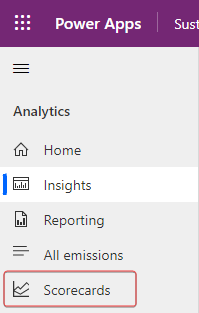
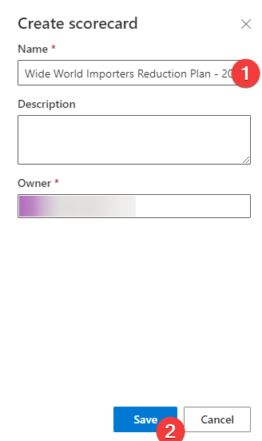

# Lab 05: Goals and scorecard

## Overview

### Background

In the previous four labs, the master and system data were set up and calculations performed to report on emissions. In this lab, the focus is on setting carbon emission reduction goals and tracking them using scorecards. In the scorecard, emission reduction goals can be introduced based on the organization’s sustainability priorities and can be collaboratively tracked with various stakeholders using the Teams collaboration feature.

### Learning Objectives

In this lab, you will do the following:

-   Create Scorecards and Goals to monitor progress towards Carbon reduction targets
-   Understand goal check-ins
-   Configure and use Microsoft Teams Chat collaboration features

### Prerequisites

-   Microsoft Sustainability manager environment is set up with sample data
-   Lab 01 organization and reference data is entered
-   Lab 02 activity data is ingested
-   Lab 03 emissions are calculated
-   Lab 04 deep analysis and reporting review

### Solution Focus Area

Scorecards and goals can help curate sustainability metrics and track them against an organization’s key business objectives. After the scorecard is created that includes goals, the scorecard progression can be periodically checked including how the scorecard is progressing and to make any required adjustments.

There will probably be times when there is a need to share and discuss data, reports, analytics, or goals across many stakeholders in the organization. To help make those conversations contextual and collaborative, Teams Chat is available directly in Microsoft Sustainability Manager.

### Personas and Scenarios

In this lab, Amber Rodrigues – Sustainability specialist for Contoso Corp creates and monitors Carbon reduction goals. Based on the insights from the Deep Analysis dashboard, Amber creates a new scorecard for Wide World Importers and creates a goal to reduce their carbon emissions from the previous year. Amber sets up automatic goal check-ins to track the ongoing status of the goal.

Finally, Amber, with the help of Reed Flores – IT Admin for Wide World Importers, configures Microsoft Teams collaboration. Once configured, Amber opens a chat with one of their colleagues to discuss changes to a factor library, continuing Ambers great work to record, report, and reduce carbon emissions across Wide World Importers and the entirety of Contoso corp.

In this lab exercise, we will focus on the scenarios illustrated below:

===

## Exercise 1: Define sustainability goals

In this exercise, you will learn about the steps that Amber takes to create scorecards and goals to help Wide World Importers track carbon reduction progress. Based on the results of the previous lab, Amber has determined that Wide World Importers needs to reduce their Scope 2: Purchased electricity carbon emissions. Scorecards and goals allow organizations to set carbon reduction targets and track their progress to that. You can explore this functionality in deeper detail on Microsoft Docs, please visit Overview of scorecards and goals +++https://docs.microsoft.com/en-us/industry/sustainability/reports-scorecards-goals+++.

1. Log in to your Cloud for Sustainability environment at +++https://make.powerapps.com+++

1. Open the **Sustainability Manager** Application
        
    

    >[!NOTE] **Note: Important.** Please make sure that you have completed the previous labs to ensure that the scorecard and goals show meaningful data.

### Task 1: Create a new Scorecard

In this task, Amber will create a new scorecard to track the goals for Wide World Importers. Microsoft Sustainability Manager utilizes scorecards to group goals together.

1.  Change the current Area to **Analytics**

    

1.  Navigate to “**Scorecards**” on the left side of the page.

    

1.  On the “Scorecards” view, click **+Add Scorecard**

    

1.  Amber uses the following information to populate the fields on the new Scorecard:
    - **Name**: Wide World Importers Reduction Plan - 2025

1.  Enter the data mentioned above:
    1.  Enter the **Name** of the scorecard, this is used for identifying the scorecard in the list.
    1.  Select “**Save**”

    

1.  Your new Scorecard will open automatically.

    

Great job, you have created a new scorecard. Scorecards are used to track progress towards an organization’s sustainability goals by serving to logically group goals together. In the next tasks we will discuss creating goals and goal check-ins. **Please continue to the next task.**
