# Lab 05: Goals and scorecard

## Overview

### Background

In the previous four labs, the master and system data were set up and calculations performed to report on emissions. In this lab, the focus is on setting carbon emission reduction goals and tracking them using scorecards. In the scorecard, emission reduction goals can be introduced based on the organization’s sustainability priorities and can be collaboratively tracked with various stakeholders using the Teams collaboration feature.

### Learning Objectives

In this lab, you will do the following:

-   Create Scorecards and Goals to monitor progress towards Carbon reduction targets
-   Understand goal check-ins
-   Configure and use Microsoft Teams Chat collaboration features

### Prerequisites

-   Microsoft Sustainability manager environment is set up with sample data
-   Lab 01 organization and reference data is entered
-   Lab 02 activity data is ingested
-   Lab 03 emissions are calculated
-   Lab 04 deep analysis and reporting review

### Solution Focus Area

Scorecards and goals can help curate sustainability metrics and track them against an organization’s key business objectives. After the scorecard is created that includes goals, the scorecard progression can be periodically checked including how the scorecard is progressing and to make any required adjustments.

There will probably be times when there is a need to share and discuss data, reports, analytics, or goals across many stakeholders in the organization. To help make those conversations contextual and collaborative, Teams Chat is available directly in Microsoft Sustainability Manager.

### Personas and Scenarios

In this lab, Amber Rodrigues – Sustainability specialist for Contoso Corp creates and monitors Carbon reduction goals. Based on the insights from the Deep Analysis dashboard, Amber creates a new scorecard for Wide World Importers and creates a goal to reduce their carbon emissions from the previous year. Amber sets up automatic goal check-ins to track the ongoing status of the goal.

Finally, Amber, with the help of Reed Flores – IT Admin for Wide World Importers, configures Microsoft Teams collaboration. Once configured, Amber opens a chat with one of their colleagues to discuss changes to a factor library, continuing Ambers great work to record, report, and reduce carbon emissions across Wide World Importers and the entirety of Contoso corp.

In this lab exercise, we will focus on the scenarios illustrated below:

===

## Exercise 1: Define sustainability goals

In this exercise, you will learn about the steps that Amber takes to create scorecards and goals to help Wide World Importers track carbon reduction progress. Based on the results of the previous lab, Amber has determined that Wide World Importers needs to reduce their Scope 2: Purchased electricity carbon emissions. Scorecards and goals allow organizations to set carbon reduction targets and track their progress to that. You can explore this functionality in deeper detail on Microsoft Docs, please visit Overview of scorecards and goals +++https://docs.microsoft.com/en-us/industry/sustainability/reports-scorecards-goals+++.

1. Log in to your Cloud for Sustainability environment at +++https://make.powerapps.com+++

1. Open the **Sustainability Manager** Application
        
    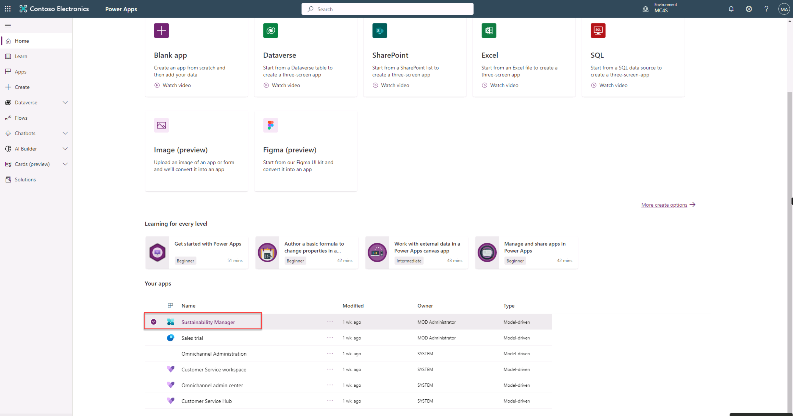

    >[!NOTE] **Note: Important.** Please make sure that you have completed the previous labs to ensure that the scorecard and goals show meaningful data.

### Task 1: Create a new Scorecard

In this task, Amber will create a new scorecard to track the goals for Wide World Importers. Microsoft Sustainability Manager utilizes scorecards to group goals together.

1.  Change the current Area to **Analytics**

    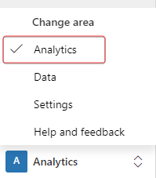

1.  Navigate to “**Scorecards**” on the left side of the page.

    

1.  On the “Scorecards” view, select **+Add Scorecard**

    

1.  Amber uses the following information to populate the fields on the new Scorecard:
    - **Name**: Wide World Importers Reduction Plan - 2025

1.  Enter the data mentioned above:
    1. Enter the **Name** of the scorecard, this is used for identifying the scorecard in the list.
    1. Select “**Save**”

    

1.  Your new Scorecard will open automatically.

    

Great job, you have created a new scorecard. Scorecards are used to track progress towards an organization’s sustainability goals by serving to logically group goals together. In the next tasks we will discuss creating goals and goal check-ins. **Please continue to the next task.**

### Task 2: Create a Goal

In this task, Amber will create a new goal instructing Wide World Importers to reduce their carbon emissions from 900 mtCO2E to 600 mtCO2E. Amber will enable automatic check-ins and status rules to ensure that the goal is automatically kept up to date. These automatic check-ins will occur once every 24 hours. Microsoft Sustainability Manager utilizes goals to help organizations like Contoso Corp and Wide World Importers track their carbon reduction goals.

1.  Select the **+Add goal** button to create a new goal.

    

1.  Amber uses the following information to populate the fields on the new Goal:
    -  **Name**: Reduce Scope 2 Emissions – 2022
    -  **Owner**: Your IAD User
    -  **Scorecard**: Wide World Importers Reduction Plan - 2025
    -  **Organizational Unit**: Wide World Importers
    -  **Start date**: 12/31/2021
    -  **End date**: 12/31/2022

    >[!NOTE] **Note**: The automatic check-in process will not perform a check-in if the current date is outside of the Start and End date range. Wide World Importers chose 12/31/2021 to include the final calculation of 2021 as the first, or base, check-in value for the new goal

    -  **Unit of measure**: mtCO2E
    -  **Starting value**: 900
    -  **Source of current value**: Connect to data
       - Data source: Emission
       - Value: CO2E
       - Filter: Org Unit equals Wide World Importers AND Consumption end date Last x years 1
    -  **Source of target value**: Enter manually
    -  **Target value**: 600
    -  **Status update method**: Automatic
       - **Value**: is greater than 600
       - **Change status to**: At risk
       - **Otherwise**: On track

1.  Enter the data mentioned above:
    1. **Name** is used for identifying the goal in the list.
    1. **Owner** is used to identify the primary person responsible for monitoring and tracking goal progress
    1. **Scorecard** is used to specify which scorecard to associate the goal with. In this scenario, because the goal was created on the scorecard page, the scorecard field is automatically filled out.
    1. **Organizational unit** is used to identify which Organizational unit the goal is associated with
    1. **Start date** is used to identify the starting time frame of the goal
    1. **End date** is used to identify the ending time frame of the goal
    1. **Unit** is used to specify which unit you would like to measure in this goal
    1. **Starting value** is used to specify your starting point for the goal
    1. **Source of current value** is used to specify what the source of the current value is, if set to Enter Manually, or where to retrieve the current value from each day. The **Source of current value** can be a roll up from other child goals, or as in this scenario, Connected to data. Amber selects “**Connect to data**”, and select “**Set up connection**”

        

        1.  Choose Emission as the Data source, this is the table where the data will come from, and CO2E as the value, this is the field where the data will come from.

            

        1.  Select **Add -> Add row**

            

        1.  In the “Select a field” dropdown, choose **Organizational unit**

            

        1.  In the “**Value**” dropdown, choose “**Wide World Importers (Organizational unit)**”

            

        1.  Select **Add -> Add row** again

            

        1.  In the “**Select a field**” dropdown, choose “**Consumption end date**”

            

        1.  In the “**Operator**” dropdown, which currently says “**Equals**”, choose “**Last x years**”

            

        1.  In the “**Value**” field, type in the number, **1**

            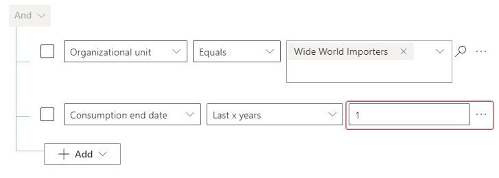

        1.  At the top of the form, select “**Calculate**” to see a preview of the data that would be used for the current value check in. Copy this value. **The value calculated may be different from the image below.**

            

        1.  The Current value data connection should look like the image below, select “**Save**” when finished.

            

    1.  **Source of target value** is used to specify what the source of the target value is. The **Source of target value** can be connected to data or, in this scenario, entered manually. Amber selects “**Enter manually**” and enter **600** to set our target of reducing our annual emissions to 600 mtCO2E.

    1.  **Status update method** is used to specify how the status of the goal check ins will be set. The **Status update method** can be entered manually or, in this scenario, automatic to automatically set the status for goal check-ins based on a set of rules. Amber selects “**Automatic**” and select “**Create rules**”
    1.  Select “**New Rule**” to start a new rule for our Status.

        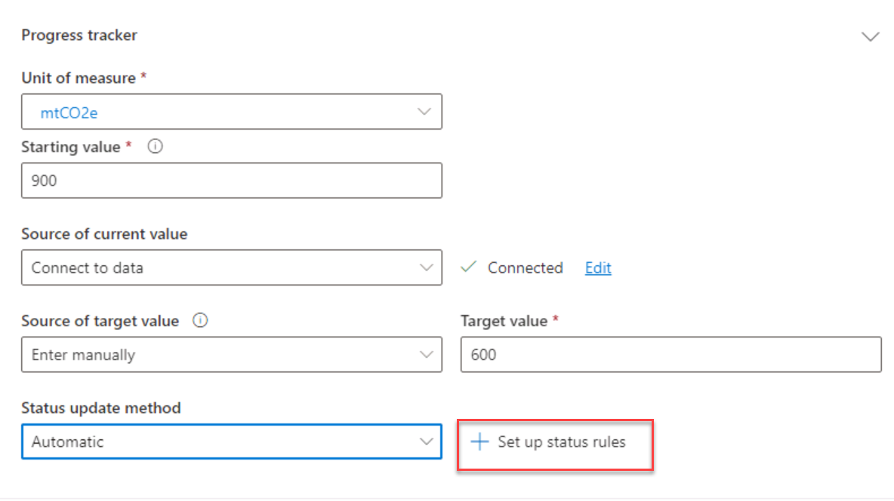

    1.  In the “**Operator**” dropdown, choose “**is greater than**”

        

    1.  In the “**Value**” field, which currently says “**0**”, enter **600**, and select “**At Risk**” from the “**Set status to**” dropdown

         

    1.  This specifies that if the check-in value is greater than 600 (our target value), then the organization is at risk, and the check-in will have a status of At risk.
    1.  In the **“Otherwise, change status to**” dropdown, select “**On track**”

        

    1.  This specifies that if the condition above is not met during a check-in, then we are on track to meeting the goal, and the check-in will have a status of On track.
    1.  The Status rules should look like the image below, select “**Confirm**”

        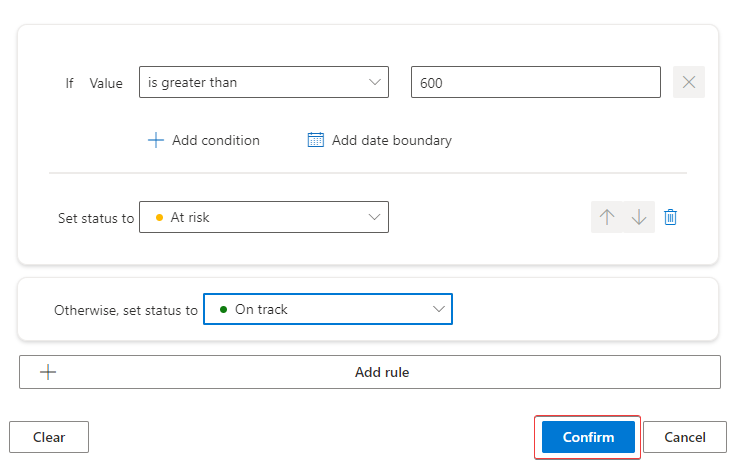

    1.  Select “**Save**”

        

1.  The new goal should be visible in the list of goals for the scorecard.

    

Great job, you have created a Goal for your scorecard. Goals are important to keep track of an organization’s progress towards reducing their carbon footprint. Any goals you have with a current value that is connected to data will have check-ins created roughly every 24 hours. Let’s go ahead and create our first check-in manually so you are familiar with the check-in data. **Please continue to the next task**

### Task 3: Create a Goal Check-in

In this task, Amber will create a manual goal check-in Wide World Importers Scope 2 reduction goal, this will be for the first check-in, so they do not need to wait 24 hours for the first check-in to occur.

Sometimes we may have goals that are set to use manually check-ins if we are not able to connect data to them, or even after a goal with connected data is created, we need to wait roughly 24 hours for our first check-in to occur. In either of these situations, you may find it useful to be able to create and review a check-in. This task will take you through the process of creating a Goal Check-in.

1.  Amber opens the goal that was created in the previous task by selecting the goal name from the list in the scorecard.

    

1.  Amber can see:

    1.  **Progress** towards the Reduce Scope 2 Emissions - 2022 goal
    1.  The goal check-in **History**
    1.  The **Goal details**

    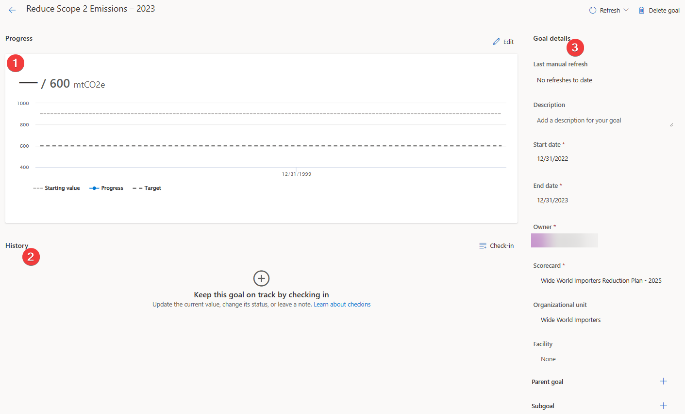

1.  In the History section, select on either the **+** or the **Check-in** button to create a new Goal check-in for the first check-in.

    

1.  A “**New check-in**” box will appear.

    

1.  Populate the New check-in with the following data:

    -   **Update for**: Use today’s date.
    -   **New value**: The preview value you copied from the Source of current value connection screen. In this scenario, 379.59
    -   **Add Note**: First check-in

1.  Enter the data mentioned above:

    1.  **Update for** is used identify what date the check-in was for. This may be the current date or a date in the past.
    1.  **New value** is used to specify the current value of the goal check-in. This value will be used on the Progress chart above
        1.  **Note:** In this scenario, the Status will be automatically set based on the Status rules we set on the goal
    1.  **Note** is optionally used if you want to provide more information or context about the check-in, such as a heatwave increased heating which resulted in an abnormally high carbon emission value for this check-in.
    1.  Select “**Save**”

    

1.  Amber now sees:
    -   The **Progress** section has updated showing the latest check-in value and status, as well its plot on the graph.
    -   The **History** section shows the recently created check-in with the status automatically set based on the goal rules. Check-ins will be shown in the order of newest to oldest.

    

Great job, you have just completed the Defining Sustainability Goals exercise. These tasks are critical to helping an organization realize their Sustainability and carbon reduction goals. Some important notes:

-  **Automated Goal check-ins run via a backend service roughly every 24 hours**, based on the time of day when the Microsoft Cloud for Sustainability was installed.
-  **As of the current release, there is not a way to change the timing for Automated Goal check-ins**.
-  You can create a manual check-in at any time.
-  You can import historical Goal Check-ins by using the native Power Platform data import wizard. The Goal Check-in table is called “**Check-ins**”

**Please continue to the next task.**

===

## Exercise 2: Set up Teams collaboration

In this exercise, Reed Flores – IT Admin for Wide World Importers will configure integration with Microsoft Teams for Microsoft Sustainability Manager. Microsoft Teams offers several features useful for organizations. By integrating Microsoft Cloud for Sustainability with Microsoft Teams, you can improve the collaboration between your sustainability team and improve the performance of your carbon reduction goals. You can quickly collaborate with colleagues utilizing Microsoft Teams Chat embedded in Dynamics 365.

>[!NOTE] **Note**: The following task, “**Enable enhanced Teams Integration**” “**and Turn on Microsoft Teams chats inside Dynamics 365**” requires Global Administrator rights in your tenant. For simplicity and security reasons, we have already completed this task in the instructor lead lab environments. We have included the instructions for you for posterity. Please continue to **Task 2: Add Link chats to Dynamics 365 records**

### Task 1: (**ONLY FOR REFERENCE, NOT TO BE PERFORMED AS PART OF THE LAB**) Enable enhanced Teams Integration and Turn on Microsoft Teams chats inside Dynamics 365

By default, the Basic and Enhanced Microsoft Teams integration is disabled in Microsoft Sustainability Manager. In this Task, Reed will enable Microsoft Teams in Dynamics 365.

1.  Change the current Area to **Settings**

    

1.  Navigate to “**Teams chat**” on the left side of the page.

    

1.  On the **Microsoft Teams collaboration and chat** page, switch **Turn on the linking of Dynamics 365 records to Microsoft Teams channels** to **Yes**.

    

1.  Select the **Save** button at the bottom left.

    

1.  After the page finishes saving, switch **Turn on Enhanced Microsoft Teams Integration** to **Yes**.

    

1.  Another pop-up window will open to grant permissions. Select the user you are signed in as currently (this account must be a global administrator).

   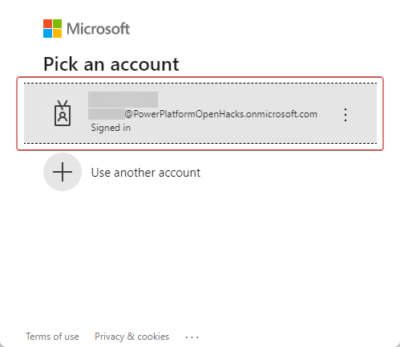

1.  Select **Accept** for requested permissions. It may take several minutes to configure. Ensure you do not have pop ups blocked that may interfere with the communication. If so, turn off blockers for this website, cancel and try connecting again.

   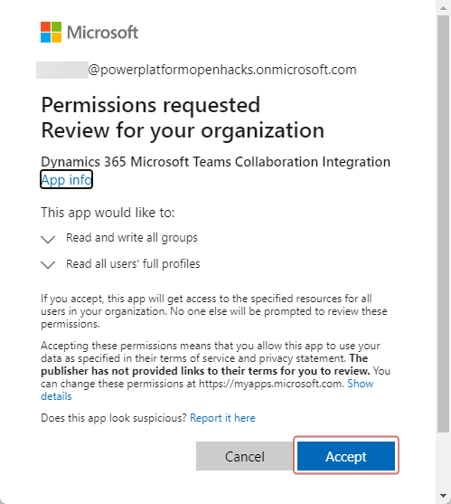

1.  Once the dialog disappears, Select the **Save** button at the bottom left.

1.  Both Microsoft Teams Integration settings are now set to Yes.

    

1.  On the **Microsoft Teams collaboration and chat** page, switch **Turn on Microsoft Teams chats inside Dynamics 365** to **Yes**.

    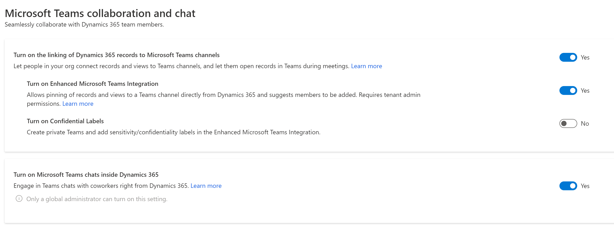

1.  Select the **Save** button at the bottom left.

    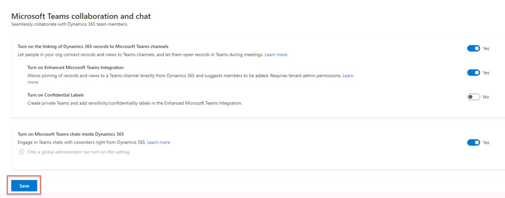

1.  Microsoft Teams chats inside Dynamics365 is now set to Yes, and a new section appears at the bottom of the screen called “**Connect chats to Dynamics 365 records**”

    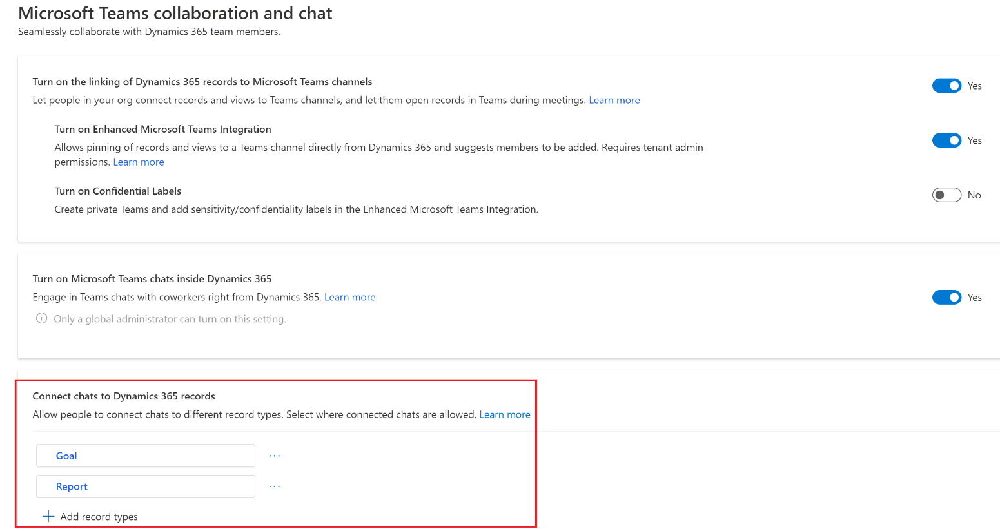

Great job, you have enabled Microsoft Teams integration for Dynamics 365 and turned on Microsoft Teams chats inside Dynamics 365. **Please continue to the next task.**

### Task 2: Add Link chats to Dynamics 365 records

In this task, Reed will add a new Dynamics 365 record type, Factor Library, to the Link chats configuration. This feature allows other record types to be linked to Teams chats directly within Microsoft Sustainability Manager.

1.  In the Microsoft sustainability manager for your environment, Navigate to Settings -> “**Teams chat**” on the left side of the page.

    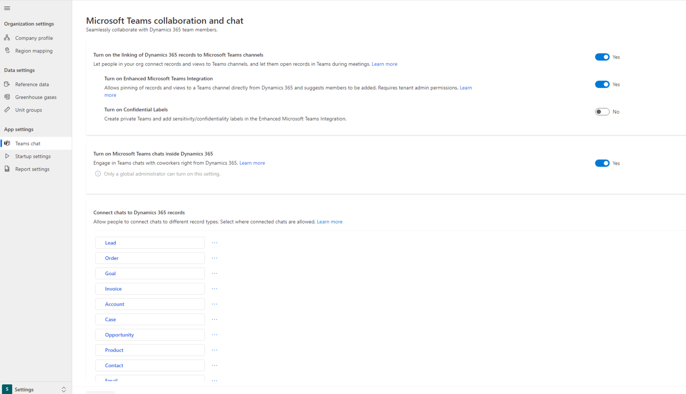

1.  On the **Microsoft Teams collaboration and chat** page, switch **Turn on Microsoft Teams chats inside Dynamics 365** to **Yes**.

1.  Select on **+Add Record Types** to add a Link chat configuration

    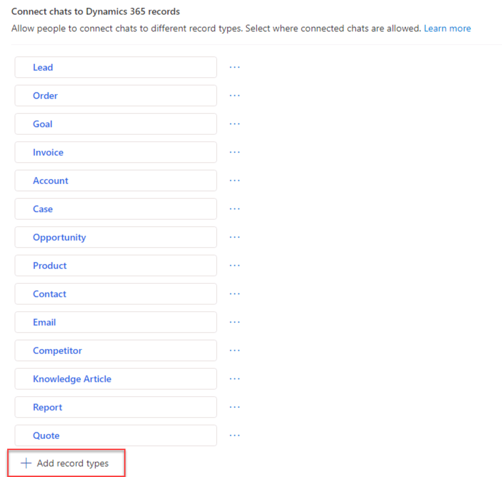

1.  On the Link chat to record type form, select **Factor library** in the **Choose record type lookup** (you can scroll or type).

    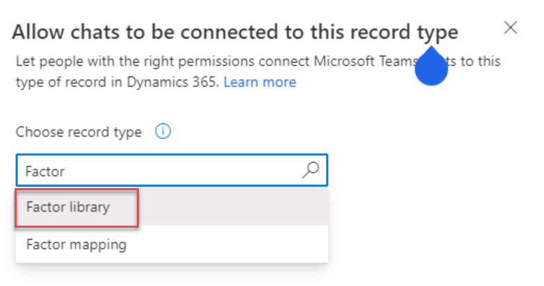

1.  Switch **Join chat** and **Introduction message** to **Yes**. Select **Factor libraries** from the Message view dropdown.

    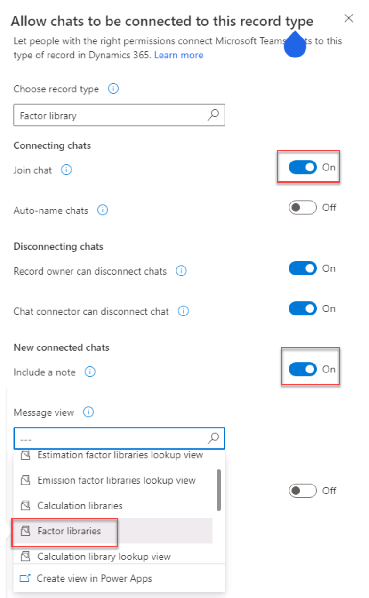

1.  Hovering the mouse over a view while the Message view list is open will give a preview of the message, the first 4-5 fields from the view are included in the message.

    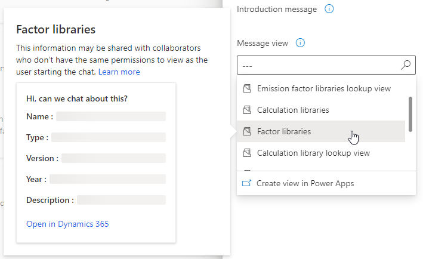

1.  Select **Save**

   

1.  Factor library is now visible in the list of linked record types

    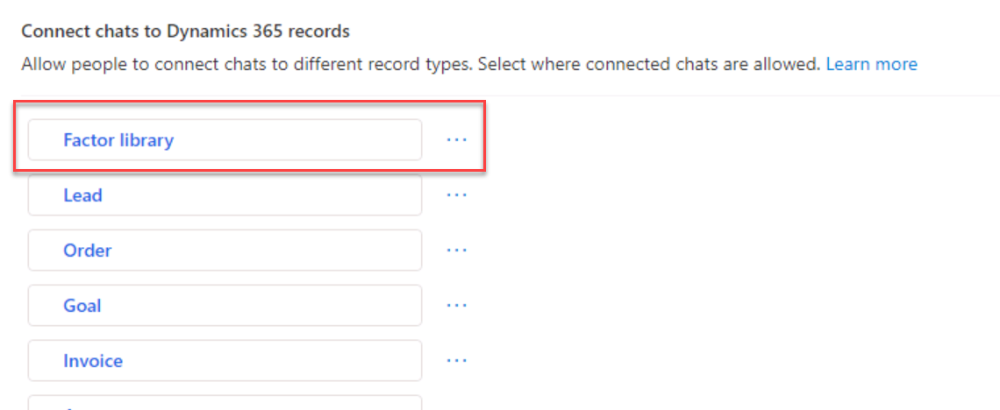

Great job, you have now turned on and configured a new entity for Microsoft Teams chats inside Dynamics 365. This will allow you to create linked Microsoft Teams chats directly inside of Cloud for Sustainability to discuss specific records. Next, we will test out the Microsoft Teams integration. **Please continue to the next task.**

### Task 3: Create a Microsoft Teams linked chat

In this task, Amber will create a linked chat to collaborate with Allen Contoso to discuss the EPA 2022 - eGRID in preparation for 2022 reporting needs.

1.  Change the current Area to **Data**

    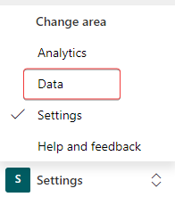

1.  Navigate to “**Factor libraries**” on the left side of the page.

    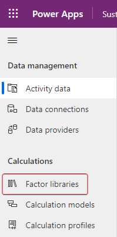

1.  Select on the **EPA 2022 - eGRID** Factor library

    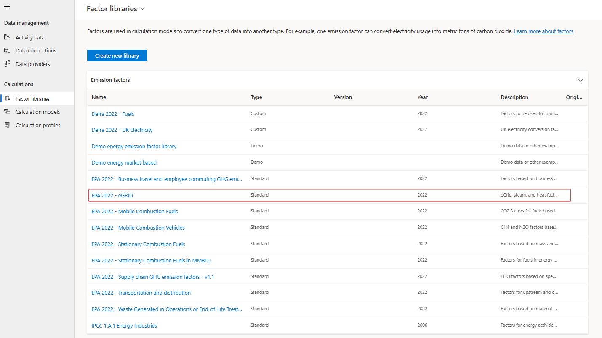

1.  Select the Chat icon in the top right corner of the screen to open the Microsoft Teams chats inside of Cloud for Sustainability.

    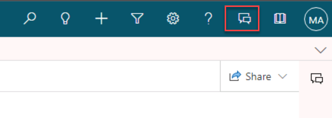

1.  Select “**New connected chat**” to create a new chat window with another user, Allen Contoso, to discuss changes to the Factor mappings on the EPA 2022 - eGRID Factor library.

    >[!NOTE] **Note**: You may need to wait a few minutes or perform a hard refresh (CTRL+F5) for the “**New connected chat**” button to appear the first time.

    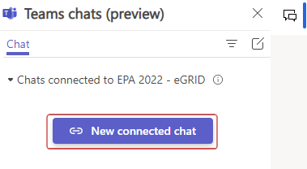

1.  On the “**New linked chat**” blade we need to:
    1.  Search for chat Participants, for this scenario use the dummy account, Allen Contoso
    1.  Add a note to provide context for the chat to the participants
    1.  When finished, select “**Start chat**”

    

1.  In a few moments an embedded chat window with all participants will appear, and a message will be displayed with the note that was included, some of the record data, and a link to the record.

    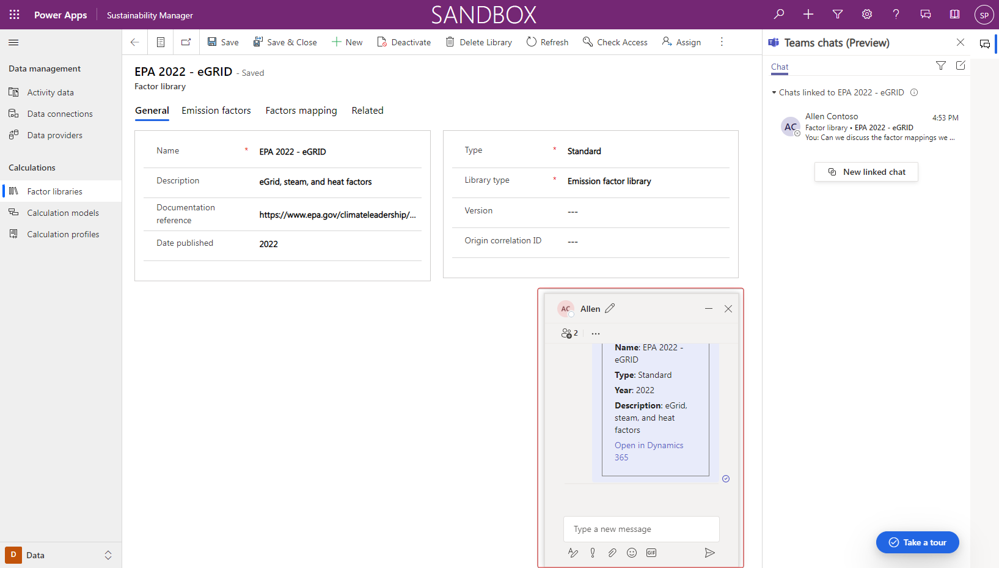

**Congratulations!** You have started a Microsoft Teams linked chat inside of Cloud for Sustainability. Linked chats can be used to help teams and organizations collaborate and improve efficiency by having the record context directly in the chat. You can configure many entities to have linked chats, as well as utilize custom system views to tailor the displayed fields to an organization’s needs.
